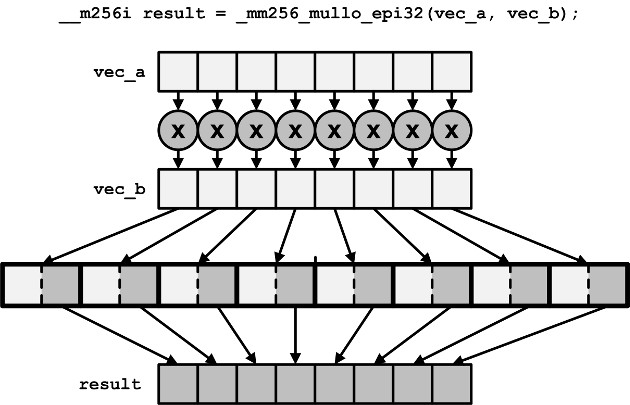
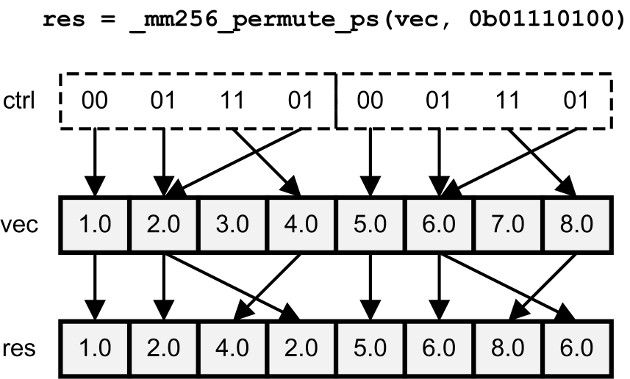

# SIMD 简介

SIMD（Single Instruction Multiple Data，单指令多数据）指令集指单个时钟周期内完成多个数据操作的指令集。

- Intel在1996年率先引入了MMX（Multi Media eXtensions）多媒体扩展指令集，开SIMD指令集之先河。  
- 在1999年Intel在Pentium III处理器中又引入SSE（Streaming SIMD Extensions）指令集，将矢量处理能力从64位扩展到了128位。
  - 在Pentium 4中Intel又将扩展指令集升级到SSE2（2000年）  
  - 而SSE3指令集（2004年）是从Pentium 4开始出现  
  - SSE4（2007年）指令集是自SSE以来最大的一次指令集扩展，它实际上分成Penryn中出现的SSE4.1和Nehalem中出现的SSE4.2，其中SSE4.1占据了大部分的指令，共有47条，Nehalem中的SSE4指令集更新很少，只有7条指令，这样一共有54条指令，称为SSE4.2   
  - 2007年8月，AMD抢先宣布了SSE5指令集，Intel却不再支持SSE5。

- 2008年3月Intel宣布Sandy Bridge微架构将引入全新的AVX(Advanced Vector Extension)指令集。   
  IntelAVX指令集主要在以下几个方面得到扩充和加强：
  - 支持256位矢量计算，浮点性能最大提升2倍
  - 增强的数据重排，更有效存取数据
  - 支持3操作数和4操作数，在矢量和标量代码中能更好使用寄存器
  - 支持灵活的不对齐内存地址访问
  - 支持灵活的扩展性强的VEX编码方式，可减少代码。 
  - 比SSE4浮点性能最大提升了2倍。  

  在2011年发布的AVX2则在此基础上加入了以下新内容：
  - 整数SIMD指令扩展至256位
  - 2个新FMA单元及浮点FMA指令(乘加融合指令)
  - 离散数据加载指令“gather”
  - 新的移位和广播指令   
  
  2013年，Intel正式发布了AVX-512指令集，将指令宽度进一步扩展到了512bit，相比AVX2在数据寄存器宽度、数量以及FMA单元的宽度都增加了一倍。

# x86 intrinsic预备知识

## **SIMD指令集头文件对应查找表** 

| 头文件         | 指令集描述 |
| -----------   | -----------|
| intrin.h      | All Architectures  |
| mmintrin.h    | MMX    |
| xmmintrin.h   | SSE    |
| emmintrin.h   | SSE2   |
| pmmintrin.h   | SSE3   |
| smmintrin.h   | SSE4.1 | 
| nmmintrin.h   | SSE4.2 | 
| immintrin.h   | AVX    |
| zmmintrin.h   | AVX512 |

## SIMD数据类型简介

SIMD数据类型： 
- __m64：64位紧缩整数（MMX）。  
- __m128：128位紧缩单精度浮点（SSE）。  
- __m128d：128位紧缩双精度浮点（SSE2）。  
- __m128i：128位紧缩整数（SSE2）。  
- __m256：256位紧缩单精度浮点（AVX）。  
- __m256d：256位紧缩双精度浮点（AVX）。  
- __m256i：256位紧缩整数（AVX）。  
注：紧缩整数包括了8位、16位、32位、64位的带符号和无符号整数。

每一种类型，从2个下划线开头，接一个m，然后是vector的位长度。  
如果向量类型是以d结束，那么向量里面是double类型的数字。如果没有后缀，就代表向量只包含float类型的数字。  
整型的向量可以包含各种类型的整型数，例如char,short,unsigned long long。

这些数据类型与寄存器的对应关系为：  
64位MM寄存器（MM0~MM7）：__m64。  
128位SSE寄存器（XMM0~XMM15）：__m128、__m128d、__m128i。  
256位AVX寄存器（YMM0~YMM15）：__m256、__m256d、__m256i

## 函数命名约定 
  
``` _mm<bit_width>_<name>_<data_type>``` 

- <bit_width> 向量的位长度，对于128位的向量，这个参数为空，对于256位的向量，这个参数为256。  
- <name> 描述了内联函数的操作。  
- <data_type> 标识函数主参数的数据类型。
  - ps 包含float类型的向量  
  - pd 包含double类型的向量  
  - epi8/epi16/epi32/epi64 包含8位/16位/32位/64位的有符号整数  
  - epu8/epu16/epu32/epu64 包含8位/16位/32位/64位的无符号整数  
  - si128/si256 未指定的128位或者256位向量  
  - m128/m128i/m128d/m256/m256i/m256d 当输入向量与返回向量的类型不同时，标识输入向量类型


# SIMD编程简介(AVX)

## 初始化Intrinsics
有两种方式来初始化AVX的vector寄存器：从标量立即数初始化和从内存加载。

### 使用标量数据初始化 
 
 
| Function | Description |
| --- | --- |
| `_mm256_setzero_ps/pd` | 初始化浮点向量为0 |
| `_mm256_setzero_si256` | 初始化整型向量为0 |
| `_mm256_set1_ps/pd` | 初始化为给定浮点值 |
| `_mm256_set1_epi8/epi16/epi32/epi64` | 初始化为给定整数 |
| `_mm256_set_ps/pd` | 用8个单精度浮点或4个双精度浮点初始化|
| `_mm256_set_epi8/epi16/epi32/epi64`| Initialize a vector with integers |
| `_mm256_set_m128/m128d/m128i` | 使用两个128bit数初始化256bit数|
| `_mm256_setr_ps/pd` | 反向初始化浮点数 |
| `_mm256_setr_epi8/epi16/epi32/epi64` | 反向初始化整数 |
 

一个事实是AVX和AVX2都没有提供无符号整数的初始化，但是有些函数却是使用无符号整数类型

### 从内存加载

| Data Type | Description |
| --- | --- |
| `_mm256_load_ps/pd` | 从对齐内存加载浮点数 |
| `_mm256_load_si256` | 从对齐内存加载整数数 |
| `_mm256_loadu_ps/pd` | 从非对齐内存加载浮点数 |
| `_mm256_loadu_si256` | 从非对齐内存加载整数数 |
| `_mm_maskload_ps/pd` <br> `_mm256_maskload_ps/pd` | 带mask的浮点数加载 |
| `_mm_maskload_epi32/64` <br> `_mm256_maskload_epi32/64` | (avx2)带mask的整数加载 |
 

## 算术相关的Intrinsics

基本算法操作包括加减乘除，乘加融合操作

### 加减操作
 
| Data Type | Description |
| --- | --- |
| `_mm256_add_ps/pd` | Add two floating-point vectors |
| `_mm256_sub_ps/pd` | Subtract two floating-point vectors |
| `(2)_mm256_add_epi8/16/32/64 ` | Add two integer vectors |
| `(2)_mm236_sub_epi8/16/32/64` | Subtract two integer vectors |
| `(2)_mm256_adds_epi8/16`  `(2)_mm256_adds_epu8/16 ` | Add two integer vectors with saturation |
| `(2)_mm256_subs_epi8/16`  `(2)_mm256_subs_epu8/16` | Subtract two integer vectors with saturation |
| `_mm256_hadd_ps/pd` | Add two floating-point vectors horizontally |
| `_mm256_hsub_ps/pd` | Subtract two floating-point vectors horizontally |
| `(2)_mm256_hadd_epi16/32` | Add two integer vectors horizontally |
| `(2)_mm256_hsub_epi16/32` | Subtract two integer vectors horizontally |
| `(2)_mm256_hadds_epi16` | Add two vectors containing shorts horizontally with saturation |
| `(2)_mm256_hsubs_epi16` | Subtract two vectors containing shorts horizontally with saturation |
| `_mm256_addsub_ps/pd` | Add and subtract two floating-point vectors |


 
 

### 乘除操作
 

| Data Type | Description |
| --- | --- |
| `_mm256_mul_ps/pd` | Multiply two floating-point vectors |
| `(2)_mm256_mul_epi32/` `(2)_mm256_mul_epu32 ` | 低位4个32位整数相乘 |
| `(2)_mm256_mullo_epi16/32` | Multiply integers and store low halves |
| `(2)_mm256_mulhi_epi16/`  `(2)_mm256_mulhi_epu16` | Multiply integers and store high halves |
| `(2)_mm256_mulhrs_epi16` | Multiply 16-bit elements to form 32-bit elements |
| `_mm256_div_ps/pd` | Divide two floating-point vectors |

`_mm256_mul_epi32`和`_mm256_mul_epu32`只有低位四个元素相乘，因为N位数相乘，结果可能是2N位。


 

`_mullo_` 会计算所有元素，但只会保存低位的一半结果。


 

### 乘加融合(FMA)

两个N位乘法的结果可能是2N位，所以两个浮点数相乘a*b，其结果其实是round(a\*b)，而且误差会累积。
AVX2的乘加融合指令返回的是round(a * b + c)，而如果单独计算返回的是round(round(a * b) + c),相比之下速度和精度均有提升。
 

| Data Type | Description |
| --- | --- |
| `(2)_mm_fmadd_ps/pd/` `(2)_mm256_fmadd_ps/pd` | (res = a * b + c) |
| `(2)_mm_fmsub_ps/pd/` `(2)_mm256_fmsub_ps/pd` |  (res = a * b - c) |
| `(2)_mm_fmadd_ss/sd ` | (res[0] = a[0] * b[0] + c[0]) |
| `(2)_mm_fmsub_ss/sd` | (res[0] = a[0] * b[0] - c[0]) |
| `(2)_mm_fnmadd_ps/pd`  `(2)_mm256_fnmadd_ps/pd ` | (res = -(a * b) + c) |
| `(2)_mm_fnmsub_ps/pd/`  `(2)_mm256_fnmsub_ps/pd` | (res = -(a * b) - c) |
| `(2)_mm_fnmadd_ss/sd` | (res[0] = -(a[0] * b[0]) + c[0]) |
| `(2)_mm_fnmsub_ss/sd` | (res[0] = -(a[0] * b[0]) - c[0]) |
| `(2)_mm_fmaddsub_ps/pd/`  `(2)_mm256_fmaddsub_ps/pd` | (res = a * b - c) |
| `(2)_mm_fmsubadd_ps/pd/`  `(2)_mmf256_fmsubadd_ps/pd ` | (res = a * b - c) |
 

**注意** 虽然AVX2提供了FMA功能，但是编译时不能仅仅提供`-mavx2`选项，也必须加上 `-mfma`。

## 数据重排 Permuting and Shuffling 

AVX/AVX2通过`_permute_`和`_shuffle_` 内建函数来重排数据

### Permuting
 

| Data Type | Description |
| --- | --- |
| `_mm_permute_ps/pd/`  `_mm256_permute_ps/pd` | 根据输入和8bit控制值输出 |
| `(2)_mm256_permute4x64_pd/`  `(2)_mm256_permute4x64_epi64` | 根据输入和8bit控制值输出 |
| `_mm256_permute2f128_ps/pd` | 根据输入和8bit控制值输出|
| `_mm256_permute2f128_si256 ` | 根据输入和8bit控制值输出 |
| `_mm_permutevar_ps/pd` `_mm256_permutevar_ps/pd ` | 根据输入和控制向量输出 |
| `(2)_mm256_permutevar8x32_ps` `(2)_mm256_permutevar8x32_epi32`   |根据输入和控制向量输出|

`_permute_` intrinsics通过一个8位的控制码来选择输入向量。



**Figure 4: Operation of the Permute Intrinsic Function**
 
`_permutevar_` intrinsics和`_permute_`操作一致，不过使用的不是8位的控制码，而是和输入向量同样大小的向量

### Shuffling

`_shuffle_` 和 `_permute_`类似，也是根据控制码从输入向量中选择数据
 
| Data Type | Description |
| --- | --- |
| `_mm256_shuffle_ps/pd` | Select floating-point elements according to an 8-bit value|
| `_mm256_shuffle_epi8/_mm256_shuffle_epi32`   | Select integer elements according to an  8-bit value |
| `(2)_mm256_shufflelo_epi16/  `  `(2)_mm256_shufflehi_epi16` |  |

All `_shuffle_` intrinsics operate on 256-bit vectors. In each case, the last argument is an 8-bit value that determines which input elements should be placed in the output vector.

 


**Figure 5: Operation of the Shuffle Intrinsic Function**
  
 

# 代码示例

```c
#include <immintrin.h>
#include <stdio.h>
void test_load() {
  int i; 
  int int_array[8] = {100, 200, 300, 400, 500, 600, 700, 800}; 
  __m256i mask = _mm256_setr_epi32(-20, -72, -48, -9, -100, 3, 5, 8); 
  /* Selectively load data into the vector */
  __m256i result = _mm256_maskload_epi32(int_array, mask); 
  /* Display the elements of the result vector */
  int* res = (int*)&result;
  printf("%d %d %d %d %d %d %d %d\n", 
    res[0], res[1], res[2], res[3], res[4], res[5], res[6],res[7]);
}
void test_fma() {
  __m256d veca = _mm256_setr_pd(6.0, 6.0, 6.0, 6.0);
  __m256d vecb = _mm256_setr_pd(2.0, 2.0, 2.0, 2.0);
  __m256d vecc = _mm256_setr_pd(7.0, 7.0, 7.0, 7.0);

  /* Alternately subtract and add the third vector
     from the product of the first and second vectors */
  __m256d result = _mm256_fmaddsub_pd(veca, vecb, vecc);

  /* Display the elements of the result vector */
  double* res = (double*)&result;
  printf("%lf %lf %lf %lf\n", res[0], res[1], res[2], res[3]);
}

void test_avx() {
  /* Initialize the two argument vectors */
  __m256 evens = _mm256_set_ps(2.0, 4.0, 6.0, 8.0, 10.0, 12.0, 14.0, 16.0);
  __m256 odds = _mm256_set_ps(1.0, 3.0, 5.0, 7.0, 9.0, 11.0, 13.0, 15.0);

  /* Compute the difference between the two vectors */
  __m256 result = _mm256_sub_ps(evens, odds);

  /* Display the elements of the result vector */
  float* f = (float*)&result;
  printf("%f %f %f %f %f %f %f %f\n", f[0], f[1], f[2], f[3], f[4], f[5], f[6], f[7]);
}

int main() { 
  test_load();
  test_fma();
  test_avx(); 

  return 0;
}
// 编译： gcc -mavx -mavx2  -mfma avx.c
// 运行： ./a.out
// 
// ？如何知道CPU所支持的指令集呢，在Linux下可以通过cat /proc/cpuinfo来查看信息;
// ? 如果是在程序中，可以通知会变CPU_ID指令，查询对应的标志位。
```

## 观点 
编译器的自动向量化特性当然是一个很好的手段，但如果理解了这些内建指令intrinsics，可以更好地帮助我们理解设计我们的算法，以达到更好的性能。


# 附录

[intel intrinsic参考](https://www.intel.com/content/www/us/en/docs/intrinsics-guide/index.html#)

[FMA指令教程](https://handwiki.org/wiki/FMA_instruction_set#FMA3_instruction_set)
 
 
 
